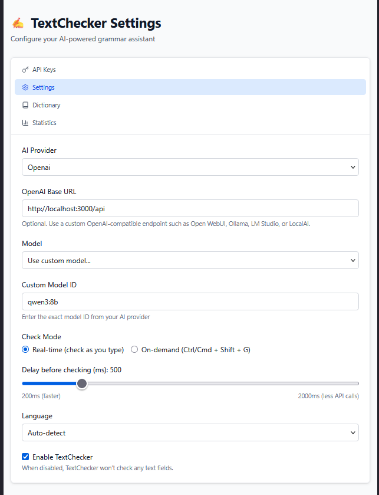
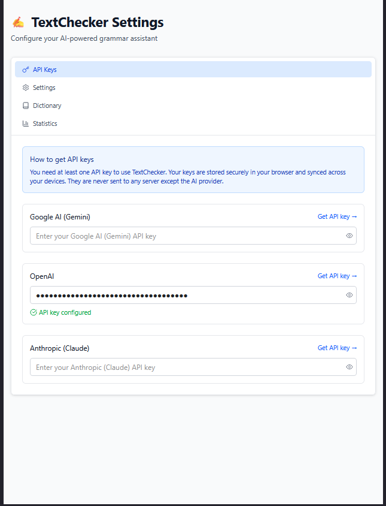

# TextChecker

An AI-powered grammar assistant for Firefox with first-class support for local LLMs.

This project is a fork of the original **TextChecker** by **codextde**, extended to support OpenAI-compatible APIs and local AI workflows.

Original project:
https://github.com/codextde/textchecker

---

## Local AI Features

This fork adds support for:

* OpenAI-compatible APIs
* Open WebUI
* Ollama
* LocalAI *(planned)*
* LM Studio *(planned)*
* Local-first grammar checking

---

## Recommended Local Models

| Model     | Status            |
| --------- | ----------------- |
| qwen3:8b  | ✅ Recommended     |
| phi4-mini | ⚠ Not recommended | 
| gemma3:4b | ⚠ Not recommended |

---

## Why this fork?

The goal of this fork is to provide the best possible local AI grammar checker without relying on cloud-based services.

While remaining compatible with OpenAI APIs, development is primarily focused on local inference through Open WebUI and Ollama.

---

## Open WebUI Configuration

TextChecker supports OpenAI-compatible APIs such as Open WebUI.

### 1. Create an API Key

In Open WebUI:

- Go to **Settings**
- Open **Account**
- Create a new API Key


---

### 2. Configure TextChecker

Open the TextChecker settings and configure:

Provider

```
OpenAI
```

OpenAI-compatible Base URL

```
http://localhost:3000/api
```

Model

```
qwen3:8b
```



API Key

Paste the API key generated by Open WebUI.



## Credits

This project is based on the excellent work of **codextde**.

Original repository:
https://github.com/codextde/textchecker


Original ReadME

# TextChecker - AI-Powered Grammar Assistant

A **free, open-source alternative to LanguageTool** browser extension. Provides grammar, spelling, and style checking using AI models, powered by your own API keys.


## Why TextChecker?

In January 2025, [LanguageTool announced](https://languagetool.org/de/webextension/premium-announcement) that their browser extension would become **paid-only**, requiring a premium subscription to use. After years of offering a free tier, they decided to restrict the browser extension exclusively to paying customers.

> *"We have made the difficult decision to restrict the use of the LanguageTool browser extension to Premium users."* — LanguageTool

**TextChecker was created as a free, open-source response** to this change. Instead of paying for a subscription, you can use your own AI API keys (Google Gemini, OpenAI, or Anthropic Claude) to get the same grammar checking functionality — often with **better results** thanks to modern AI models.

### TextChecker vs LanguageTool Premium

| Feature | TextChecker | LanguageTool Premium |
|---------|-------------|---------------------|
| Price | **Free** (pay only for API usage) | ~$60-150/year |
| AI-powered checking | Yes (Gemini, GPT, Claude) | Yes |
| Browser extension | Yes | Yes |
| Real-time checking | Yes | Yes |
| Style suggestions | Yes | Yes |
| Privacy | Your API keys, your data | Third-party servers |
| Open source | Yes | No |

## Features

- **Multi-provider AI support**: Google Gemini, OpenAI GPT, and Anthropic Claude
- **Real-time checking**: Grammar checked as you type (configurable)
- **On-demand checking**: Use keyboard shortcut (Ctrl/Cmd + Shift + G)
- **Inline suggestions**: Underlines errors with click-to-fix popovers
- **Personal dictionary**: Add words to ignore
- **Statistics tracking**: Track your writing improvements
- **Privacy-first**: Your API keys are stored locally and synced via Chrome, never sent to third-party servers

## Supported Checks

- Spelling errors
- Grammar mistakes
- Punctuation issues
- Style improvements

## Installation

### Download from Releases (Recommended)

1. Go to the [Releases page](../../releases/latest)
2. Download the zip file for your browser:
   - `textchecker-chrome-*.zip` for Chrome, Edge, Brave, Arc
   - `textchecker-firefox-*.zip` for Firefox
3. Extract the zip file

**Chrome / Edge / Brave / Arc:**
1. Go to `chrome://extensions/` (or `edge://extensions/`, `brave://extensions/`)
2. Enable "Developer mode" (toggle in top right)
3. Click "Load unpacked"
4. Select the extracted folder

**Firefox:**
1. Go to `about:debugging#/runtime/this-firefox`
2. Click "Load Temporary Add-on"
3. Select any file from the extracted folder

### Build from Source

1. Clone this repository:
   ```bash
   git clone https://github.com/yourusername/textchecker.git
   cd textchecker
   ```

2. Install dependencies:
   ```bash
   npm install
   ```

3. Build the extension:
   ```bash
   npm run build
   ```

4. Load the extension in Chrome:
   - Go to `chrome://extensions/`
   - Enable "Developer mode"
   - Click "Load unpacked"
   - Select the `.output/chrome-mv3` folder

## Configuration

1. Click the TextChecker icon in your browser toolbar
2. Click the settings icon to open the options page
3. Add your API key for at least one provider:
   - [Google AI Studio](https://aistudio.google.com/apikey) (Gemini)
   - [OpenAI Platform](https://platform.openai.com/api-keys)
   - [Anthropic Console](https://console.anthropic.com/settings/keys)
4. Choose your preferred provider and model
5. Select check mode (real-time or on-demand)

## Development

```bash
# Start development server with hot reload
npm run dev

# Build for production
npm run build

# Build for Firefox
npm run build:firefox

# Create distribution zip
npm run zip
```

## Tech Stack

- [WXT](https://wxt.dev/) - Chrome Extension Framework
- [React](https://react.dev/) - UI Library
- [Tailwind CSS](https://tailwindcss.com/) - Styling
- [Vercel AI SDK](https://ai-sdk.dev/) - Multi-provider AI Integration
- TypeScript - Type Safety

## Supported Languages

TextChecker supports grammar checking in multiple languages including:
- English
- German
- Spanish
- French
- Portuguese
- And many more (auto-detected)

## Privacy

- Your API keys are stored in Chrome's sync storage and are never sent anywhere except directly to the AI provider you choose
- Text is only sent to the AI provider when checking grammar
- No analytics or tracking
- Fully open source - audit the code yourself

## Contributing

Contributions are welcome! Please feel free to submit a Pull Request.

## License

MIT License - see [LICENSE](LICENSE) file for details.

## Keywords

LanguageTool alternative, free grammar checker, open source grammar checker, LanguageTool replacement, browser grammar extension, AI grammar checker, Gemini grammar checker, GPT grammar checker, Claude grammar checker, free LanguageTool alternative 2025

## Acknowledgments

- Created as a free alternative after [LanguageTool's decision to go premium-only](https://languagetool.org/de/webextension/premium-announcement)
- Built with [WXT](https://wxt.dev/)
- Powered by [Vercel AI SDK](https://ai-sdk.dev/)
